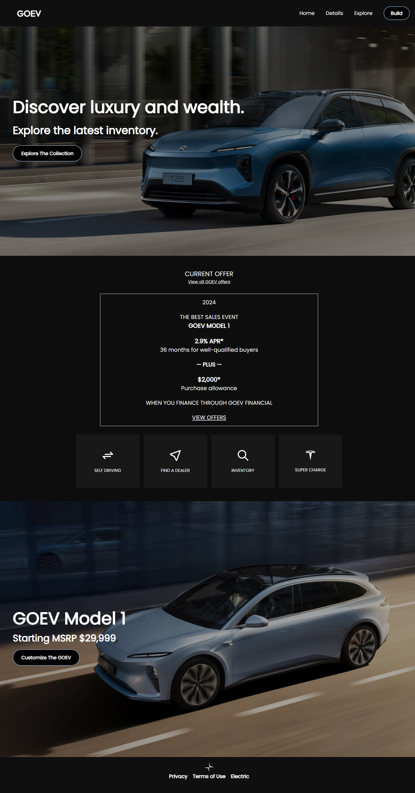
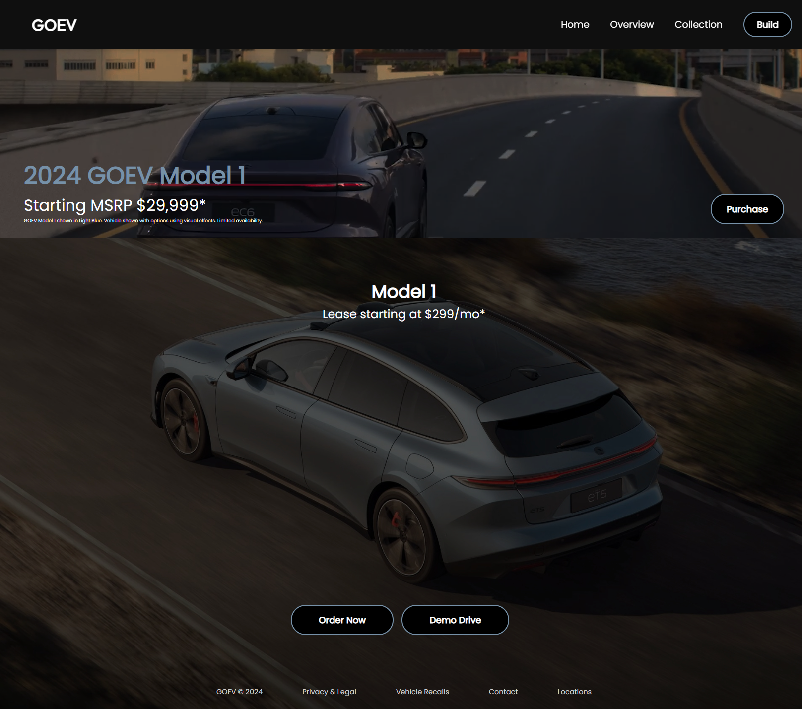

<h2></h2>

👉 Live Demo: <a href='https://goelevate.vercel.app'>GOEV Demo</a>

<h3>Built using:</h3>

» React JS  
» CSS  
» HTML 

 

<h2>Project Screenshots</h2>
 
<h3 align='center'>Home Page 🏠</h3>

  

  

<h3 align='center'>Car Page 🚗</h3>

  

