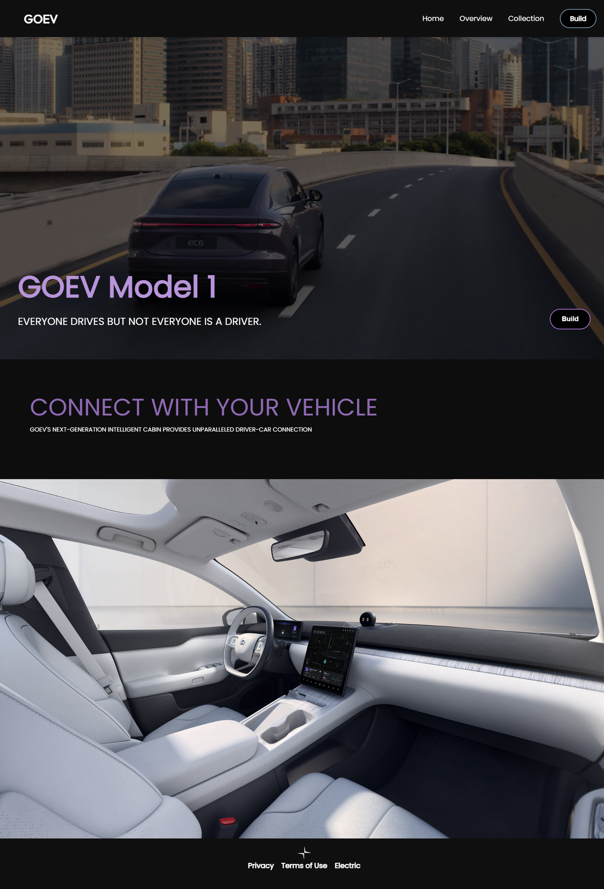

<h2>About the project</h2>
  

        <b>GOEV</b> is a groundbreaking project within my portfolio, showcasing my skills in JavaScript, React, HTML, and CSS. This fictional company stands at the forefront of the electric vehicle (EV) revolution, embodying my commitment to sustainable mobility and innovation.
      

      

        Through this project, I have leveraged the power of React to create a dynamic and user-friendly interface. The HTML and CSS components seamlessly come together to enhance the visual appeal and responsiveness of the website, providing users with an engaging experience.
      

      

        Join me on this virtual journey as we explore the future of transportation, redefined by GOEV's cutting-edge electric cars. Experience the seamless integration of technology and design that reflects my dedication to creating impactful and innovative web solutions.
      

👉 Live Demo: <a href='https://goev-five.vercel.app'>GOEV Demo</a>

<h3>Built using:</h3>

» React JS  
» CSS  
» HTML 

 

<h2>Project Screenshots</h2>
 
<h3 align='center'>Home Page 🏠</h3>

  

  

<h3 align='center'>Car Page 🏎️</h3>

  

  

<h3 align='center'>Overview 🔥</h3>

  

