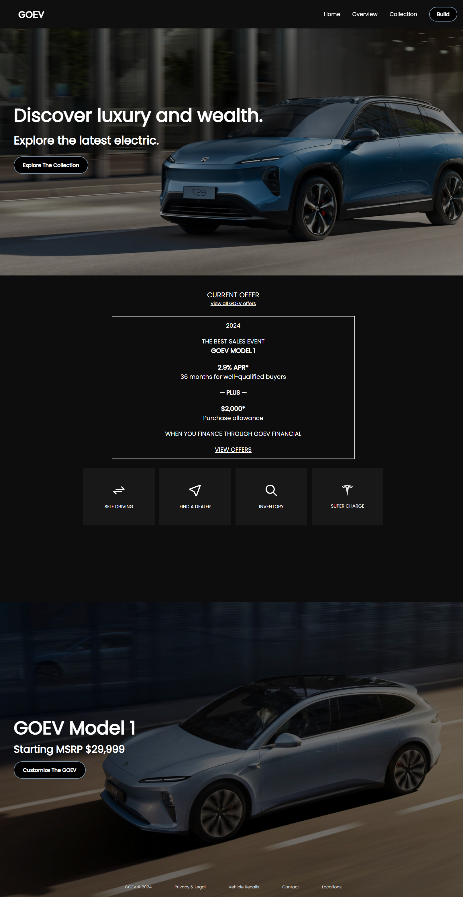

<h2>About the project</h2>

This involved developing a responsive and user-friendly React application for the GOEV website, employing modern web technologies to elevate the overall user experience and optimize site performance. React components were utilized to seamlessly integrate lazy loading techniques, facilitating accelerated loading times for images. Additionally, responsive design principles were implemented to enhance the website's accessibility across diverse devices and screen sizes. These endeavors were aimed at creating a dynamic and accessible platform for users engaging with the GOEV website.

👉 Live Demo: <a href='https://goelevate.vercel.app'>GOEV Demo</a>

<h3>Built using:</h3>

» React JS  
» CSS  
» HTML 

 

<h2>Project Screenshots</h2>
 
<h3 align='center'>Home Page 🏠</h3>

  

  

<h3 align='center'>Car Page 🚗</h3>

  

